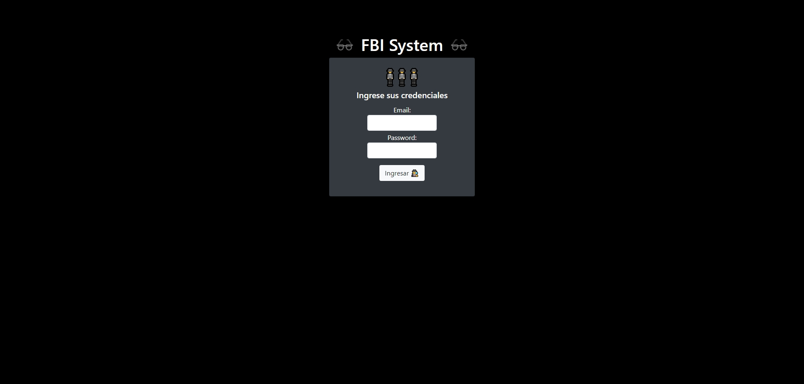

# Desafío evaluado - FBI System

Este desafío consiste en crear un sistema para gestionar misiones secretas para el FBI. Deberás desarrollar un servidor con Express que utilice JWT para la autorización de agentes que visiten páginas restringidas.

## Descripción

El FBI ha abierto un nuevo departamento de informática y necesita un sistema online para gestionar misiones secretas. Tendrás que construir un servidor que autentique a los agentes y gestione el acceso a las páginas restringidas utilizando JSON Web Tokens (JWT). Se te proporcionará un archivo de apoyo con credenciales de agentes y una interfaz HTML.

## Vista del Diseño

A continuación, se muestra una imagen de la interfaz cliente preparada para interactuar con el servidor:

## Requisitos

### 1. Autenticación y Generación de Token

- **Ruta**: `POST /auth`
- **Descripción**: Crea una ruta que autentique a un agente basado en sus credenciales y genere un token JWT con sus datos.

### 2. Autenticación y Respuesta HTML

- **Ruta**: `POST /auth`
- **Descripción**: Al autenticar un agente, devuelve un HTML que:
  - Muestra el email del agente autorizado.
  - Guarda un token en `SessionStorage` con un tiempo de expiración de 2 minutos.
  - Disponibiliza un hiperenlace para redirigir al agente a una ruta restringida.

### 3. Ruta Restringida

- **Ruta**: `GET /restricted`
- **Descripción**: Crea una ruta restringida que:
  - Devuelva un mensaje de bienvenida con el correo del agente autorizado.
  - En caso contrario, devuelva un estado HTTP que indique que el usuario no está autorizado y un mensaje con la descripción del error.

## Autor

Este proyecto fue desarrollado por **Valeria Torrealba**.

